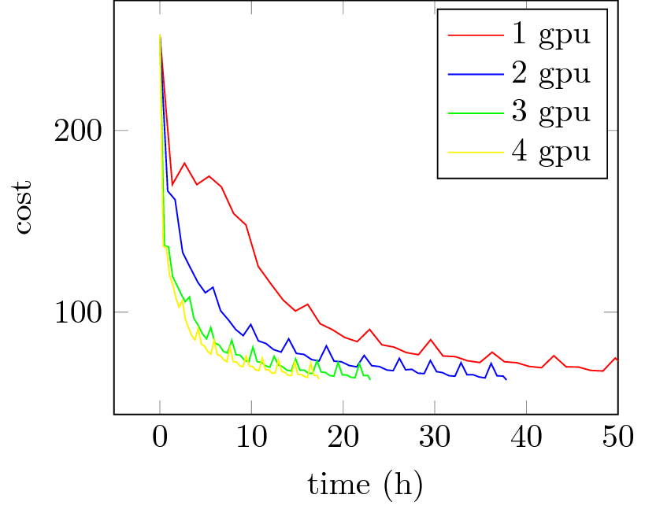
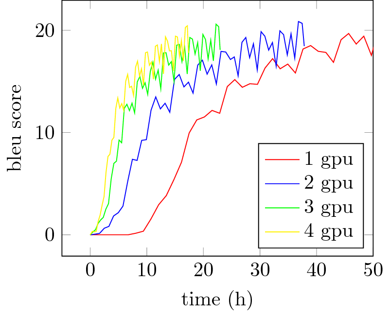

# pnmt - (Data) Parallel Neural Machine Translation

This repository contains scripts for training Neural Machine
Translation (NMT) models with [theano](https://github.com/Theano/theano/)
in a data parallel fashion.
Most of the work was part of my master thesis at the
Ludwig-Maximilians-Universität in Munich which I am now continuing as
a research assistant.
The code is built upon the [dl4mt code](https://github.com/nyu-dl/dl4mt-tutorial).

For parallelism the algorithms _hogwild!_ [\[1\]](#ref1),
_asynchronous dual averaging_ and _asynchronous adagrad_ [\[2\]](#ref2)
are implemented.

To use these algorithms for other applications (i.e. models defined
as theano graphs) you may want to consider checking out
[async-train](http://github.com/valentindey/async-train) which this
project is built upon.

The most commonly used sequential gradient based optimization algorithms
are also provided as option.

## Requirements

are easily installed with pip

    pip install -r requirements.txt

Different versions of python 3 *may* work, but this code was developed
and tested for python 3.5.2.

## Data

To download and prepare English to French translation data run the
following commands

    cd data
    ./prepare_data.sh

This downloads and prepares WMT data for training and newstest 2011 for
testing. Data for other language pairs is downloaded with this script
as well. To prepare further data, adjust the commands in this script to
your needs.

For tekenization the `tokenizer.pl` script from 
[moses](https://github.com/moses-smt/mosesdecoder) is used.

## Training a Model

For convenience a shell script is supplied that calls `pnmt.py` with
common settings. It only requires to set the path to store the trained
model, the used optimization algorithm and the devices to run on.

    ./run_training.sh model.npz hogwild gpu0,gpu1

For more options, see

    ./pnmt.py --help

Make sure that the option `--params-dtype` matches theano's `floatX`.
This must be set separately due to theano's config not being accessible
prior to the compilation of the model for each concurrent process.

For comparison common (non-parallel) optimizing algorithms are also supplied.

## Translating Text

Once you have trained a model, you can use it to translate text from
the source language to the target language with the script `translate.py`.

Note that this is only deterministic when run with `--num-threads` set 
to 1 (and thus being slower).
For other settings the order of processing sentences can not be
guaranteed. Due to the use of a random number generator which yields
results dependent on that order, the resulting translations may differ.
The order of output translations is ensured to match the order
of the input sentences nevertheless!

## Results

The major goal here is to test the effect of asynchronous optimization
algorithms for training NMT models.

An overview of results so far can be found in [my thesis](thesis.pdf)
(section 6.5). Note that these correspond to no "real-world settings".

Some further experimentation shows the increase of training speed on
GPUs very well.
A translation model (europarl corpus, english to french) showed the
following trajectories for cost/bleu score measured on some validation
data:

These results were achieved with Nvidia GeForce GTX 1080 GPUs

## References

<a name="ref1">[1]</a> Recht, B., Re, C., Wright, S., & Niu, F. (2011). 
 Hogwild: A lock-free approach to parallelizing stochastic gradient descent. 
 In Advances in Neural Information Processing Systems (pp. 693-701).
 
<a name="ref2">[2]</a> Duchi, J., Jordan, M. I., & McMahan, B. (2013). 
 Estimation, optimization, and parallelism when data is sparse. 
 In Advances in Neural Information Processing Systems (pp. 2832-2840).
